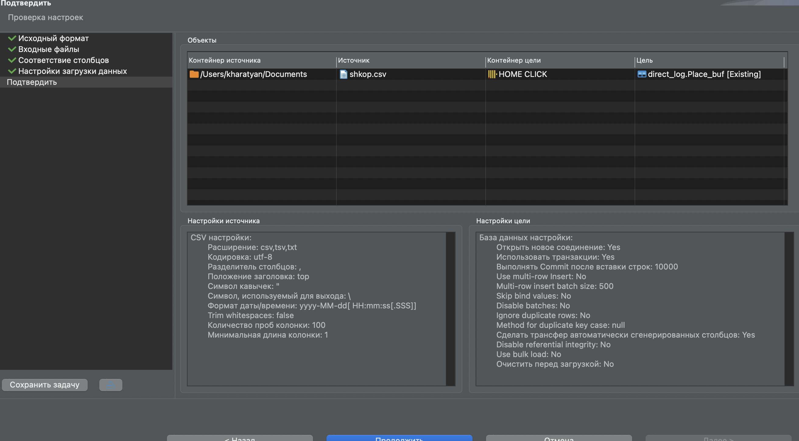

1. Поднять кликхаус в докере
```
docker run -d -p 8123:8123 --name my_click_server --ulimit nofile=262144:262144 clickhouse/clickhouse-server
```
2. [2.sql](2.sql)
3. [3.sql](3.sql)
4. [4.sql](4.sql)
5. [5.sql](5.sql)
6. [6.sql](6.sql)
7. 
